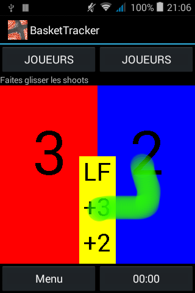

# basketball

Entrez et obtenez les statistiques d'un match de basketball, en mode live.

Lorsque vous êtes dans les tribunes, ou en face de votre télévision, cette application
vous permet de "noter" en temps réel les actions des joueurs, et vous pourrez à la fin du match
vous envoyer par email les statistiques des joueurs, la liste de toutes les actions du jeu, etc.

Bien que l'application ne soit pas très "belle" (je suis mauvais en design), elle est parfaitement
fonctionnelle.
Elle vous permet notamment en quelques gestes de rapidement:

- entrer les numéros des joueurs de chaque équipe
- ajouter un shoot à 2 ou 3 points réussi ou raté pour un joueur particulier
- idem pour les lancers-francs
- envoyer un email avec toutes les actions et statistiques du jeu

Entrer un shoot raté ou réussi se fait en un seul geste: comme on le voit sur l'image ci-dessus,
l'écran est divisé en deux colonnes, une pour chaque équipe.
Au milieu se trouvent les symboles du shoot à 2pts, 3pts et du lancer-franc.



- Si un shoot à 3 points est réussi, faites glisser votre doigt en partant du symbole "+3" vers l'équipe qui a marqué en terminant votre geste vers le haut (pour indiquer un shoot réussi), comme le montre le tracé en vert sur l'image.
- Si un shoot à 2 points est raté, faites de même en terminant votre geste vers le bas, comme le montre la deuxième image pour un shoot à 2 pts raté par la première équipe.
- Juste après, l'écran change pour lister les joueurs de l'équipe qui a shooté: cliquez simplement sur le joueur qui a shooté.
- A la fin du match, envoyez les stats par email via le menu, en bas à gauche.


## Extensions

L'utilisation de l'appli avec les doigts prend trop de temps lorsqu'on est en pleine action dans un match.
Pour faciliter l'enregistrement des stats, la prochaine version fonctionnera par la voix:
l'idée sera d'appuyer sur un gros bouton pendant que l'on parle, et les séquences ainsi enregistrées seront
taggées par un timestamp et transcrites automatiquement si possible en local en temps réel sinon
après le match sur un PC (l'idée est bien de développer un système de reconnaissance de la parole léger qui
reste entièrement local et permet de reconnaître des séquences simples : cf. JTrans).

Les séquences à reconnaître seront basiques, selon la grammaire suivante:

```
[non] [(3-points | lancer-franc | contre)] [raté] numéro_joueur
```

Le "non" optionnel du début permet d'annuler la séquence précédente et de la remplacer par le reste de la séquence.

## TODO

- faire enregistrer les mots-clefs de base en local
- démultiplier les exemples en ajoutant du bruit, des filtres
- calculer les MFCC de toutes ces séquences
- exporter les fichiers MFCC pour l'apprentissage
- sur un PC, entraîner un LSTM + linear + softmax: récupérer les paramètres
- écrire l'inférence pour le même en pure java-android avec ces paramètres


